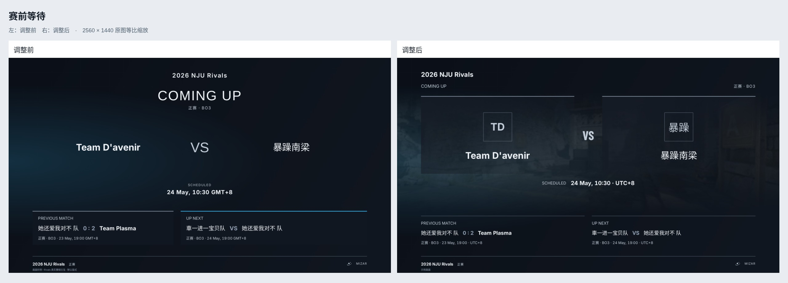
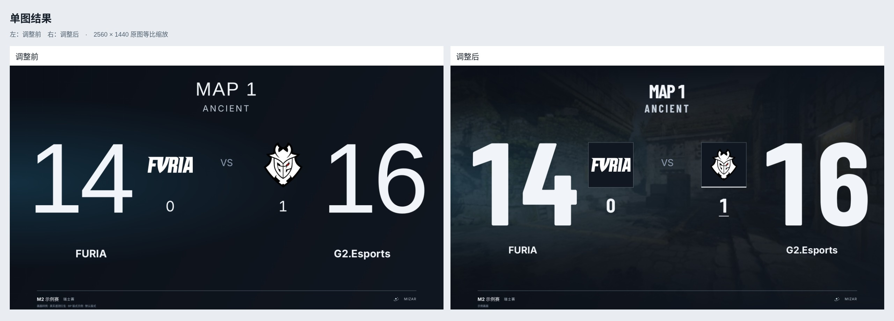
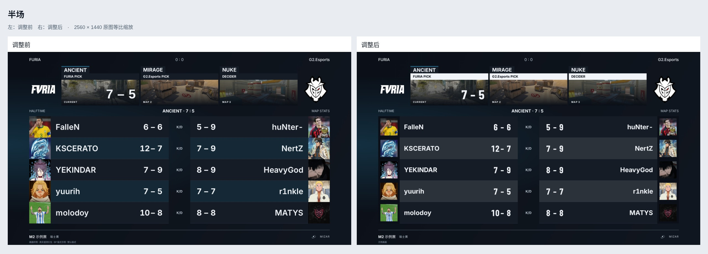
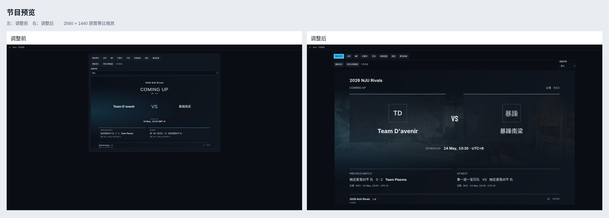
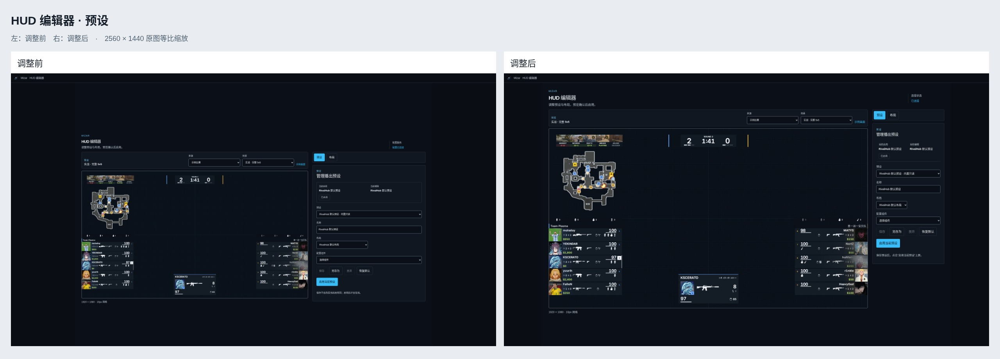
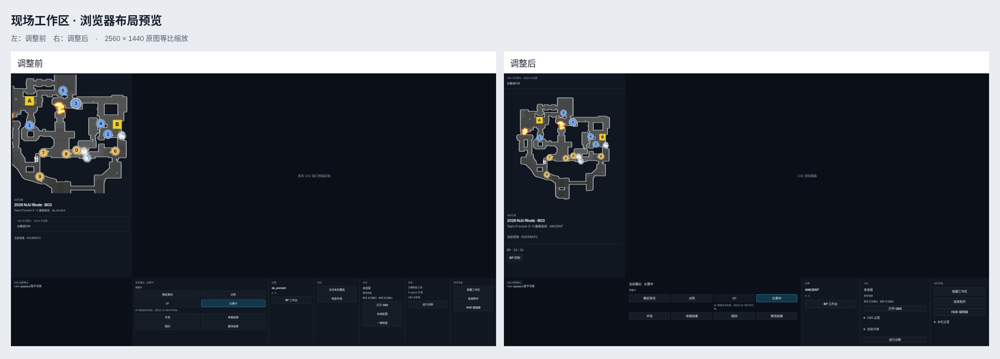
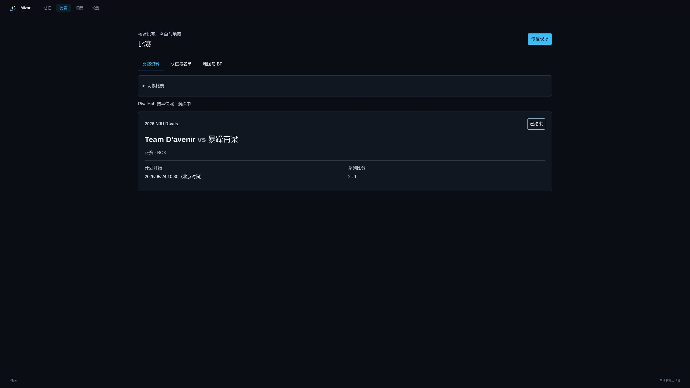
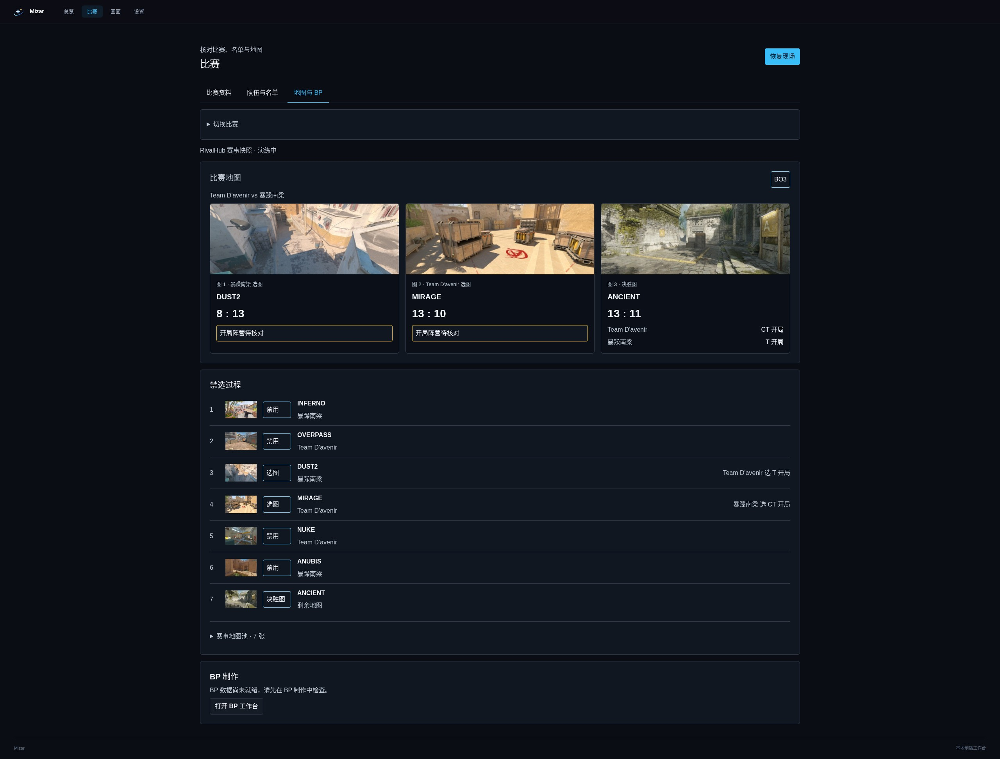
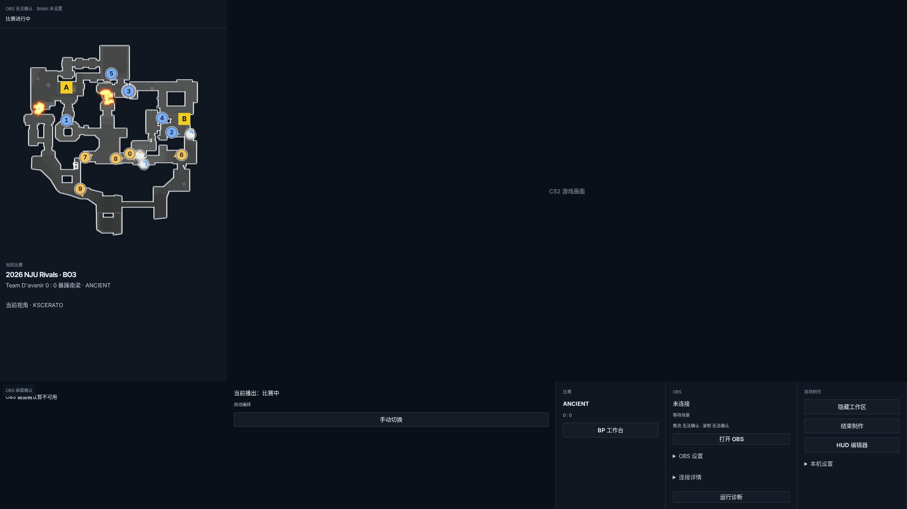

# Issue #107：视觉复查与页面任务

本轮依据四张用户提供的赛事画面、仓库 BP 参考和现有制作工作流调整。保留大比分、十人数据表和正式播出英文标签；产品操作使用简洁中文。Gameplay HUD 本体重绘另行开展。

## 参考图的有效设计

- 单图结果的重点确实是比分。参考画面使用窄体重字、固定队徽容器、两侧对称轴和明确的地图标题；大数字周围的空间使比分更有力量。问题不在字号本身。
- 数据表接在比分场景之后，继续以选手数据为主体。借鉴两队分区、稳定的头像裁切、姓名与数据的对齐，以及清晰的隔行对比，不新增无来源的角色标签或选手能力。
- 地图卡与主内容之间有清楚的间隔，各阶段共享字体和素材处理。借鉴这种统一性，不复制赛事专属颜色、纹理、队徽或人物资产。

实现保留单图比分固定锚点，增加本地 Barlow Condensed Bold 展示字体；规范方标与宽标比例；无媒体时保留占位和队名缩写。等待场景改为赛事、双队对阵、开赛时间、前后赛程；数据场景保留原有十人表格，改善头像、字号与对比。对阵开场正式输出保持透明，游戏背景由 CS2 / OBS 提供。

## 页面任务与工作流

| 页面 | 用户要完成的任务 | 主要入口 / 下一步 |
| --- | --- | --- |
| 总览 | 确认当前比赛，完成开播检查 | 处理「需要关注」，进入现场 |
| 比赛资料 | 选择比赛、核对赛事与时间 | 核对名单、地图；RivalHub 资料沿用赛务流程更新 |
| 队伍与名单 | 核对双方首发与替补 | 独立模式可从服务器识别并确认队伍；绑定赛事时查看官方名单 |
| 地图与 BP | 核对地图顺序与禁选 | 打开 BP 工作台进行实际播出操作 |
| 画面 / 节目预览 | 检查场景、样例和转场效果 | 选择场景、播放演示；普通预览保持只读，BP 操作区明确提示会同步播出 |
| HUD 编辑器 | 调整预设与布局，检查画布 | 保存 → 启用；保留两步操作以避免未完成编辑直接上屏 |
| 设置 | 连接游戏、OBS 与 RivalHub | 展开对应连接配置，返回总览确认 |
| 现场工作区 | 观察游戏、切换播出场景、处理当前任务 | 左上简短直播状态；左侧完整地图雷达与比赛信息；底栏以播出控制为主 |
| 运行诊断 | 查明连接或数据问题，导出诊断 | 检查状态与恢复建议，按需查看详细数据 |

准备到现场的顺序为「选择比赛 → 核对名单与地图 → 检查画面和连接 → 进入现场」。比赛中以游戏、雷达和当前任务为主，OBS 维护与连接详情按需展开。地图结束显示单图比分，再进入数据页；继续下一图或完成赛后任务。场景编排、命令、数据 owner 与计时语义沿用既有实现。

## 现有参考项目

本轮查看了仓库 `docs/references.md` 及以下公开资料，只借鉴职责和组织方式：

- [HOT README](https://github.com/papesgit/hot)：以观察工作区为中心，游戏画面与操作工具协作；保留 Mizar 的窗口 owner 与安全投影，不引入 HLAE 技术前提。
- [Eon README](https://github.com/mortenlein/eon)：Live Control、Layout Editor、Series & Maps 的任务划分，以及等待与统计场景的分工。
- [Lexogrine CS2 React HUD](https://github.com/lexogrine/cs2-react-hud)：明确区分 HUD 配置面板与播出渲染。本轮扩大编辑画布、固定属性栏，不复制其 HUD 或配置契约。

## 本轮检查与边界

- 操作页按 2560×1440 截图，另附 HUD 编辑器 125% 缩放。节目场景保持 1920×1080 逻辑画布，等比输出 2K 原图。
- Chromium 自动检查窄窗、长名称、无素材、多赛制、键盘焦点、减少动效和开场交接；视觉截图为审查证据，不是永久像素基线。
- 工作区雷达默认完整地图，容器保留内边距。自动缩放不是默认行为；HUD 的既有完整地图默认值保持一致。
- 截图环境为 Linux Chromium；远程队徽可能不可用，缺图回退保持真实。原生 Windows 字体、CS2 嵌入、OBS 捕获和推流仍需实机验收。
- 不重绘 Gameplay HUD，不改变比赛事实或网站接口，不复制参考项目资产。

## 前后对比

左侧为本轮调整前（8ce560d），右侧为本轮调整后。工作区示例数据的时效状态可能随采集时间变化。

## 比赛资料与 BP 复核

2026-10-03 对照了 [Team D’avenir vs 暴躁南梁的线上比赛页](https://match.starfie1d.top/2026-nju-rivals/matches/d9987c41-180a-4113-8003-c6d18d1ba1e6)、RivalHub 的 `src/lib/mizar/context.ts`、`VetoView.tsx` 与本仓库 2026-09-29 的赛事快照。线上结果是 2:1；演练会按阶段调整状态与已揭示比分，截图不作为线上实时状态证明。

| 信息 | 现有来源与用途 | 界面处理 |
| --- | --- | --- |
| 赛事、队伍、阶段、赛制 | 网站已经提供；用于等待、对阵、BP、结果等播出画面 | 合并为对阵摘要，沿用原有播出投影 |
| 轮次 | 网站可提供数字轮次、淘汰赛轮次或标签；本例三者均为空 | 有值时供准备页核对，不再把空轮次显示为「未填写」；不从 BO3 或比赛结果猜轮次 |
| 比赛说明、赛果意义 | 当前网站接口固定返回空，现有播出场景没有对应位置 | 移除常规输入；既有值保留在补充资料，避免数据丢失 |
| 计划开始 | 网站提供时间，等待场景使用 | 资料页标明北京时间；本例 UTC 02:30 对应北京时间 10:30 |
| 地图与选图队伍 | 比赛地图与禁选记录 | 按比赛顺序分卡，保留选图归属、比分和决胜图；尚未打出的决胜图也可从禁选记录展示 |
| 开局阵营 | 地图开局阵营、明确选边步骤、旧选图内嵌选边 | PICK 的内嵌 side 属于对手；选边步骤及明确队伍的 DECIDER 属于该队。统一显示双方开局阵营；证据冲突时提示核对 |

本例快照的 Dust2、Mirage 地图开局阵营与旧 BP 选边记录冲突；线上 BP 页也明确显示相应选边队伍。新 UI 保留逐步记录，并在地图卡显示「开局阵营待核对」。未修改网站数据，也未解除 Core 现有的 BP 冲突阻断。

填写与维护按 owner 分工：本地比赛只保留当前有用途的输入；网站连接模式提供当前比赛的「在网站管理」入口。工作区的自动模式默认收起八个场景按钮，展开只影响显示，选择场景才进入手动保持；恢复自动会重新收起。BP 入口和进度统一在底栏比赛区。

自动模式截图使用同一赛事快照与浏览器模拟的自动状态，用于检查控件收起布局；自动/手动命令流另由浏览器验收覆盖。比赛资料与地图截图使用完赛演练阶段，保留快照原始结果。

