# 默认 HUD 精修复核

基于已合并 ESL 的 main `78e7d9c`，在现有默认节目包继续精修。旧版对照为 PR #124 的 `7b2896d`；预设仍为五套。所有图使用同一 Program 样本、Steam 头像、1920×1080 画布、Ancient 静态缩略图和缩放比例。参考方案保留各自已保存的布局、字形与头像处理，不把 ESL 的宽图像槽当成素材优势。背景不是 CS2/OBS 实机画面；Radar 只作固定的 rich-live 对照背景，不宣称各状态的同期回放。

## 最终取舍

- 选手卡：蓝灰身份层与完整冰白战斗带；武器、HP、经济和装备统一落在战斗带上，不再用局部白块切割卡面。姓名 21px Inter / 中文回退、HP 38px Barlow Condensed、K/D 14px、经济 16px；4px 圆角。76px 头像槽内放置 64px 方图，留出 6px 边框；自然字宽表达身份，凝缩大数字表达战斗能力。
- 比分：深色队伍翼、两个有内边距的浅色比分块、深色计时区；64px 比分与 30px 正常时间区分。外缘 6px、比分块 4px 圆角；下包/拆弹保留事实颜色与局部目标表达。
- 死亡：五人外框、行位与昵称起点不动；可见正文收至 272×56，头像仅显示上方 56px；整条浅色战斗带撤去。姓名、DEAD、已取得的统计与辨认标记保留，击杀徽记避开死亡文字。
- 暂停：浅色比分/经济横栏与倒计时，深色身份与金钱，浅色装备模块；中央冰白赛事区与适配尺寸的蓝色弧形。没有新场景或时钟。
- 历史：已完成回合浅底，未来回合深底，缺失回合保持空缺；CT/T 底边表达当时胜方，图标仍表达真实胜因。
- 地图条：原图片行 28px，队标 28px 加 5px 顶偏移使底部超出行区。改为 22px 方形 contain 槽与 3px 顶边，完整显示宽/方队标；地图文字不再碰到图像。
- 弧形：Focus 按 86×64、暂停按 160×190 绘制，保持相同比例的开口曲线；固定比例后裁切，不再非等比拉伸成窄条。Waiting、Intro 与统计/结果构图保留。

## 同资料前后

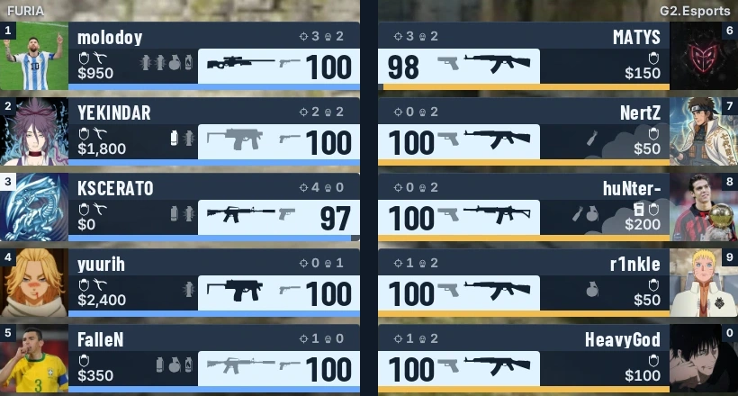

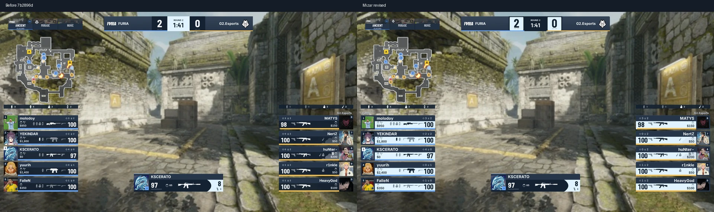
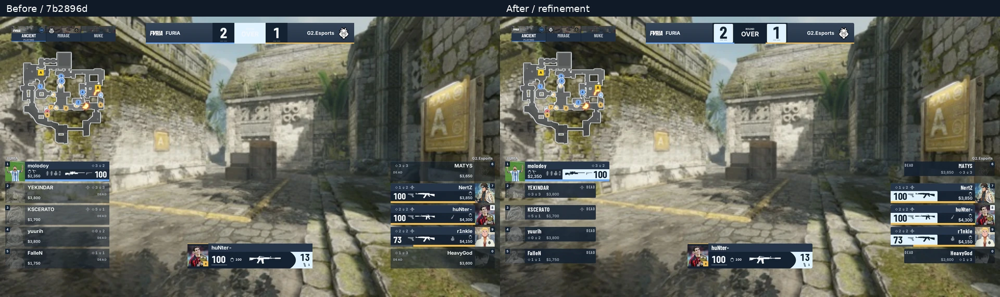
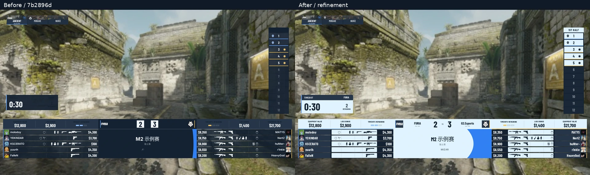
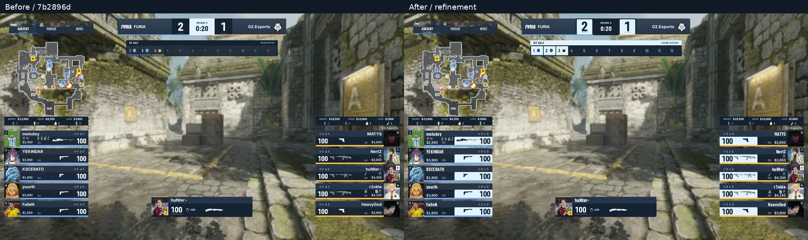

## 五套同状态实图

每列均按相同比例缩小；顺序为 Mizar / EWC / IEM / Perfect World / ESL。原图分别以 `current/ewc/iem/perfectworld/esl-状态.webp` 保存在同目录。

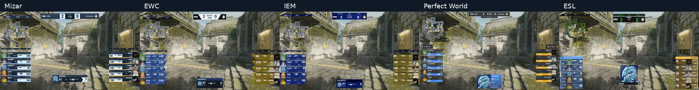
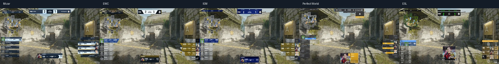
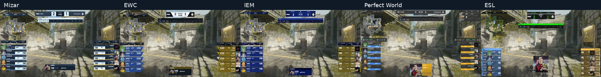
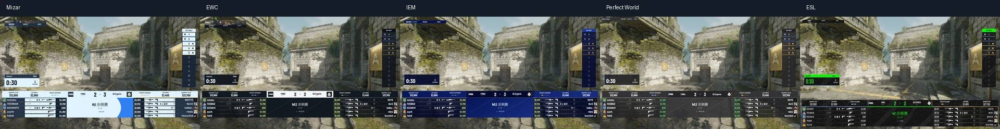

真实样本为 `real-live-rich`、`real-exploded`、`real-post-explosion-freezetime`、`real-timeout-ct`、`real-paused`。满装备使用既有 `player-rails-freezetime`，长名使用 `stress-long-labels`，两者明确为合成展示边界，不冒充真实比赛。

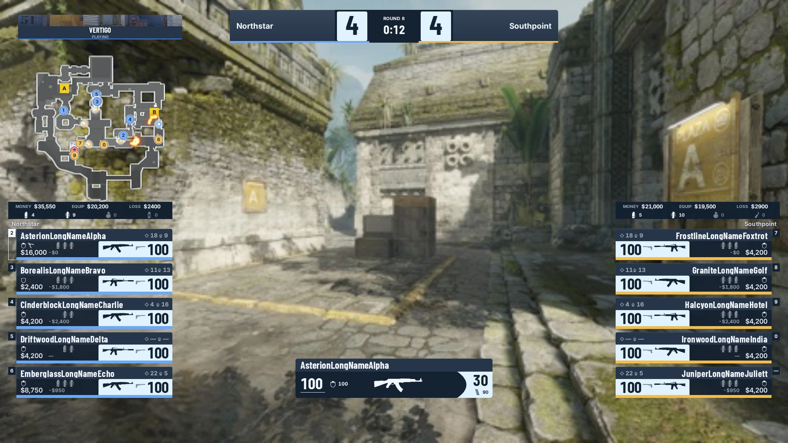
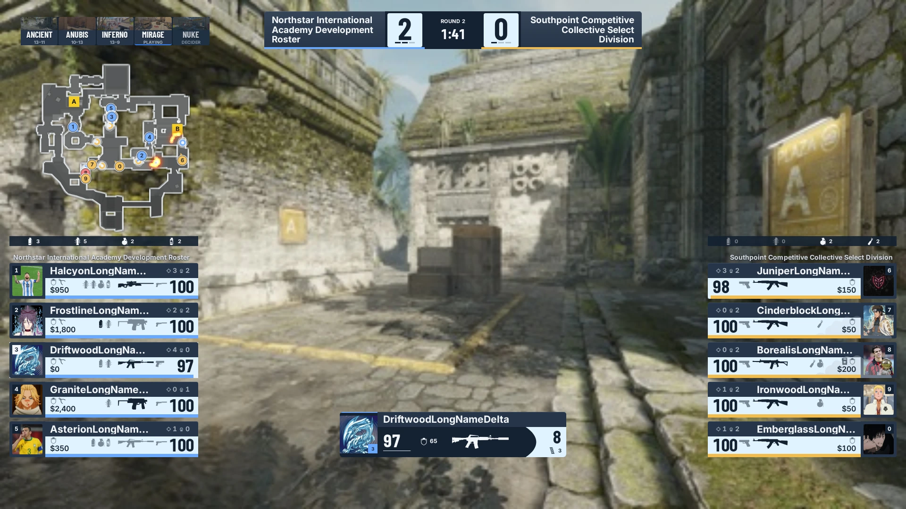
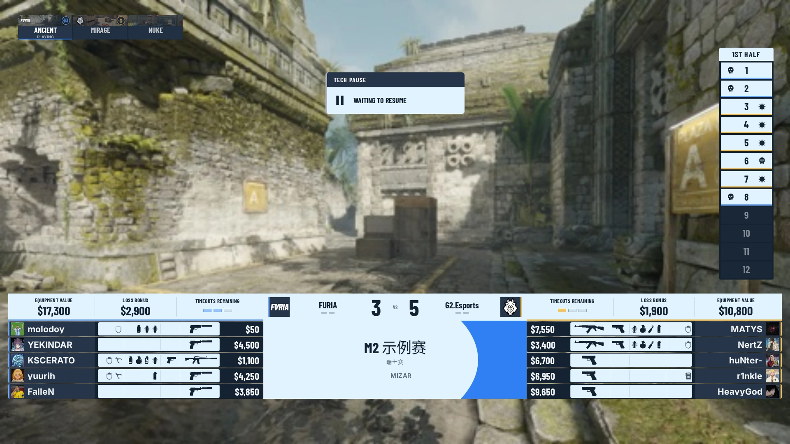

## 验证与边界

本轮属于播出画面；复用现有品牌 token / HUD recipe，不引入产品主题、颜色通道、依赖或共享组件。小圆角属于当前 renderer 的固定美术；动态 reduced motion、缺媒体、统计开关、暂停归属、stale 隐藏与固定行位沿用既有 owner。浏览器新增检查死亡可见区域、姓名/状态/徽记不重叠，以及队标位于图片行内。

自动化执行结果见 PR 当前 revision 的验证记录。图片是人工视觉审查资料，不是像素基线。实现环境为 Linux + Chromium；Windows + CS2 + OBS 合成与现场验收仍待平台验证。
