# Mizar 原生转播包装 · 视觉复核

本轮基于 `origin/main` 的 `badbdbc8676b26239f8b2b72d1633f3bbf0fd123`，升级现有默认预设。实现与证据同一 PR；图片是人工视觉复核资料，不是新增整站像素基线。

## 方向与边界

EWC 的明暗主次与减重、IEM 的空间秩序、上海的身份与装备生命表达，重新组合成直边信息网格、钴蓝/冰白开口弧面、蓝灰分层材质的 Mizar 默认版。比分与 HP 用 Barlow Condensed，姓名用 Inter / 中文回退。CT/T、事件状态与品牌颜色分开，Mizar 标志仍是次级署名。Gameplay 不新增 Logo、星空、粒子或持续发光。

| 页面 | 本轮动作 | 明确保留 |
| --- | --- | --- |
| 默认 HUD | 顶部 800px 主条、400px 五人卡、横向低 Focus；启用既有冻结历史与同画布暂停 | 事实、时钟、配置开关、Radar 坐标与亮度 |
| Waiting | 左侧当前比赛、右侧已取得赛程；无赛程收拢 | 场景职责、真实计划时间、缺媒体降级 |
| Matchup | 透明进入、停留、实测槽位交接；完整/短版独立编排 | 6s/2s 预算、Director/accepted clock、取消与跳过 |
| BP | 字体、背景、明暗；移除 A/B 固定蓝黄 | 七/九/多步地图结构、列宽、信息层级和揭示流程 |
| Halftime / Intermission / Match Result | 共用背景材质 | 地图条、比分、阵容、780/120/780 网格和 5×120 行、署名 |
| Map Result | 共用背景底色 | 大比分、胜方表现、队标、系列比分全部保留 |
| EWC / IEM / Perfect World | 代表性回归 | recipe、布局、状态行为与外观 |

没有新增依赖、预设、产品设置或媒体接入。旧默认 snapshot 的精确历史 envelope 仍可读取，位置/主题/设置不变；使用同一个新 renderer 的窄尺寸规则，没有 old-default 分支。

## 前后对比

图中左为上述 main 基线，右为本 PR。Gameplay 使用相同真实 GSI fixture、比赛身份与状态；底图仅为 Ancient 官方缩略图，**不是 CS2/OBS 实机录像**。

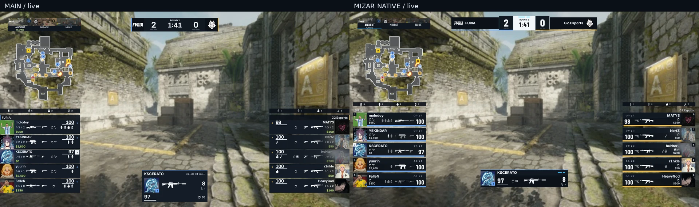
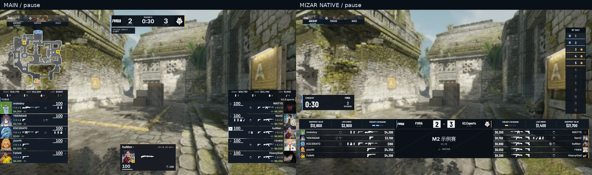
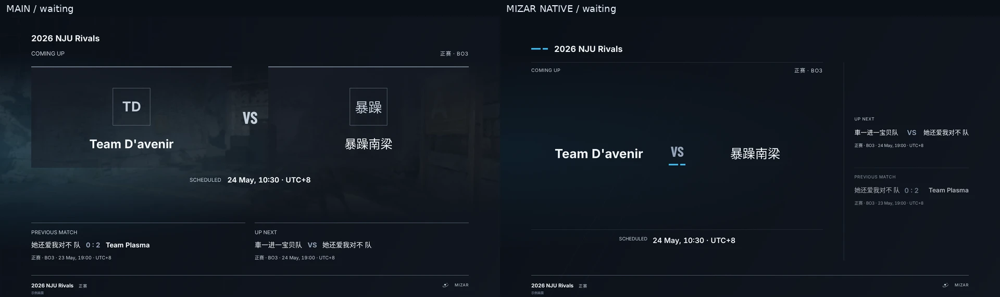

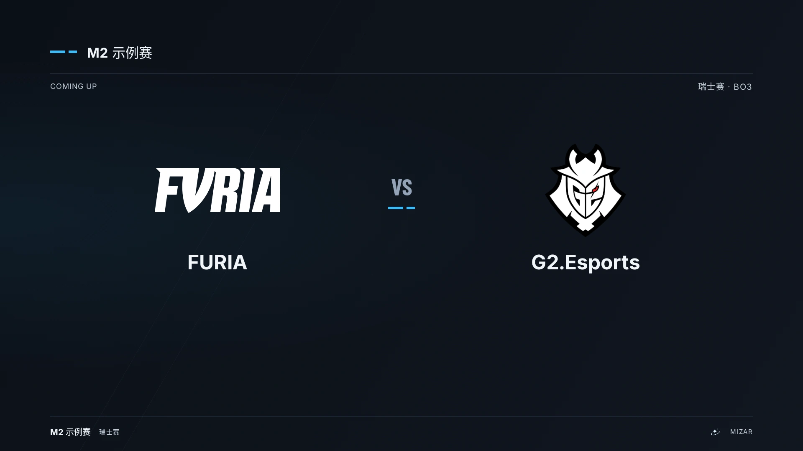
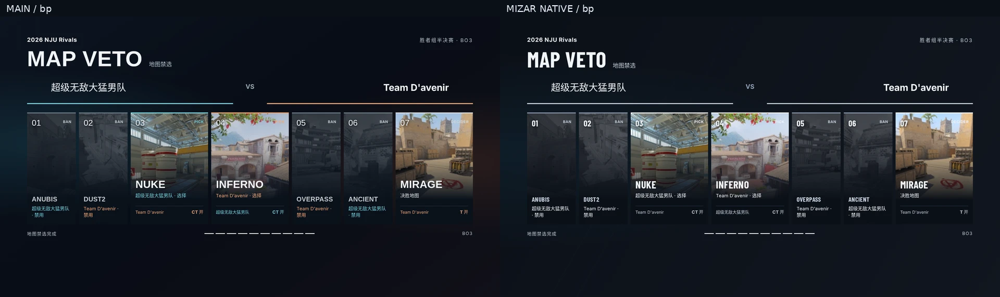
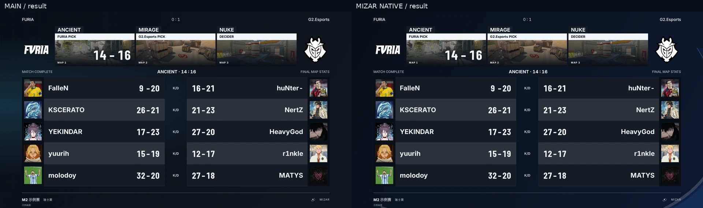

## 本次继续打磨

与 `324060a` 的同资料对比：

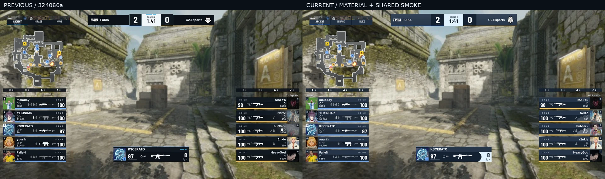
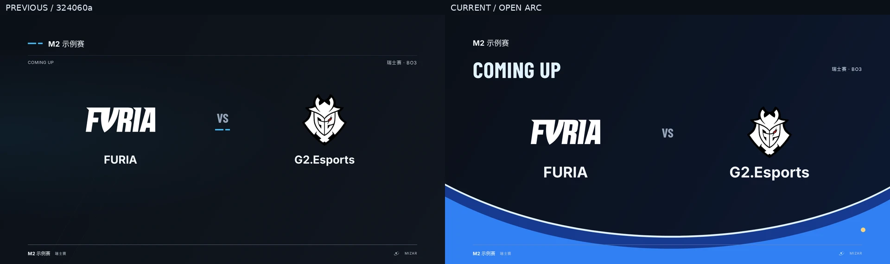

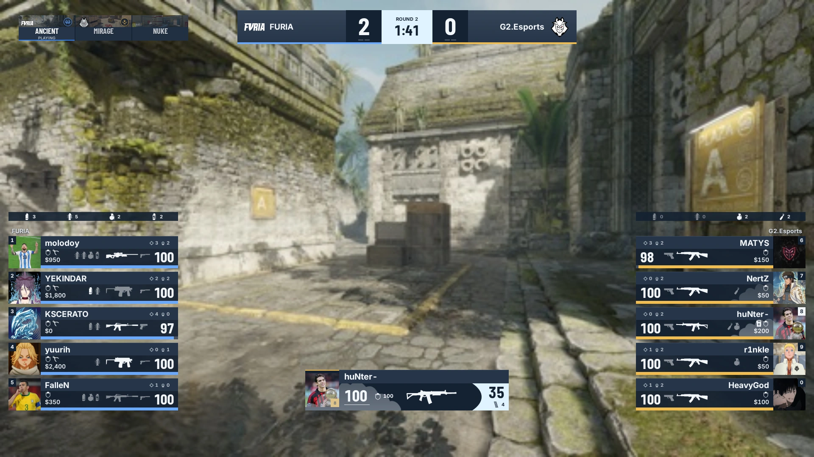

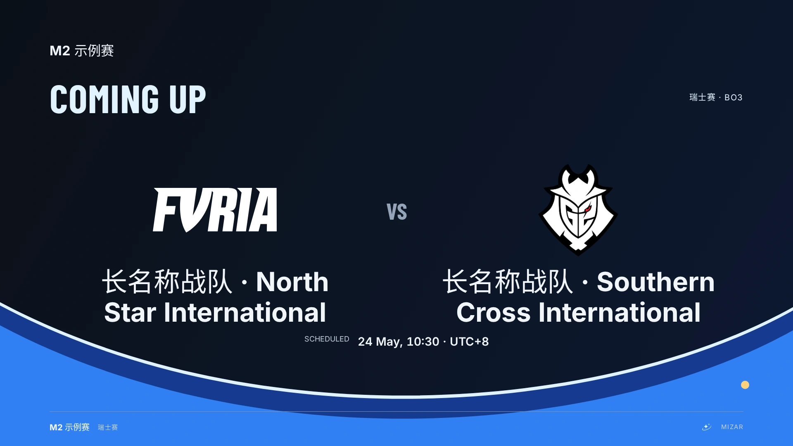

烟雾图保留 `real-live-rich` 的真实选手状态，只将观察目标切换至受烟雾影响的选手。长名 Waiting 图组合既有双语长名、冻结队标和计划时间样例。两者都是明确的展示边界，不宣称真实录像或真实对阵发生过这些组合。

## 连贯画面与动画

- [默认节目包连续预览](mizar-native/program-reel.webm)：实际 `/preview` 播放演示，包含 Waiting、BP、Matchup、Gameplay、半场、单图结果、图间和整场结果。Waiting/BP 使用仓库 NJU Rivals 公开资料，游戏与统计页使用 FURIA/G2 真实回放衍生样本；这是一套视觉包装的演示，不宣称它们属于同一场比赛。
- [完整 6 秒开场](mizar-native/intro-full.webm)、[短版 2 秒](mizar-native/intro-short.webm)、[缺队标交接](mizar-native/intro-no-media.webm)：Chromium 实际生产动画录制，剪去页面导航准备帧，保留完整动作和 0.6 秒交接后画面，未用生成图代替动画。静态地图底图只辅助观察透明叠加。
- [1920×1080 Live](mizar-native/live.webp)、[冻结购买](mizar-native/freeze.webp)、[暂停](mizar-native/pause.webp)、[Waiting](mizar-native/waiting.webp)、[Match Result](mizar-native/match-result.webp)。

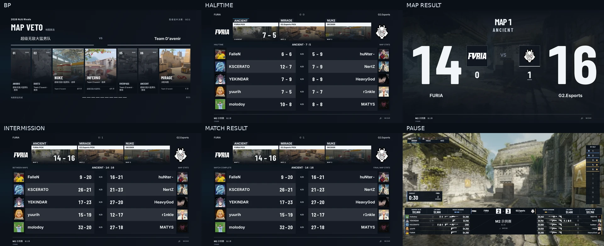

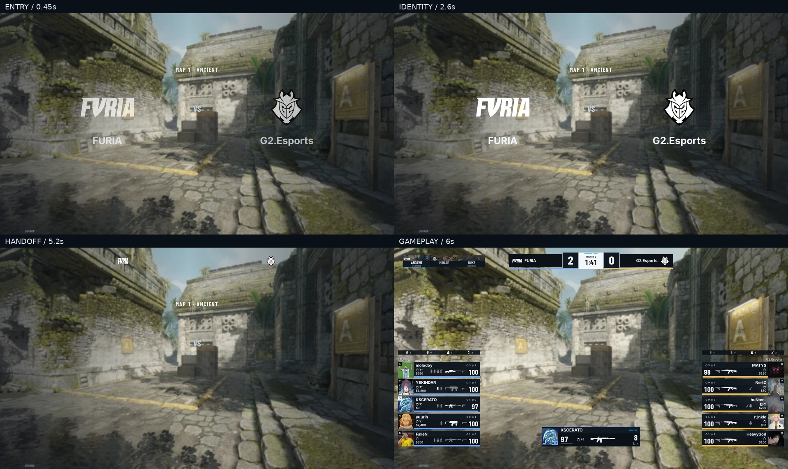
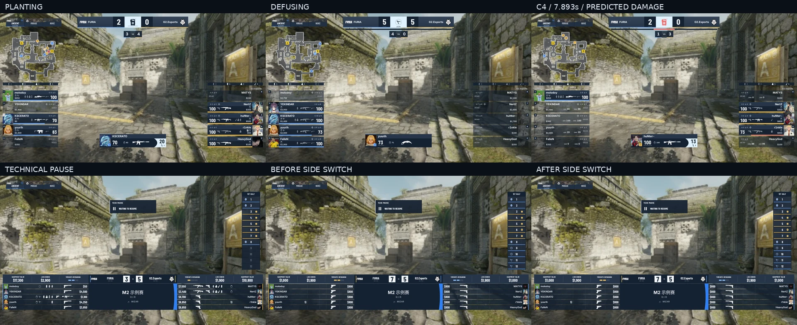
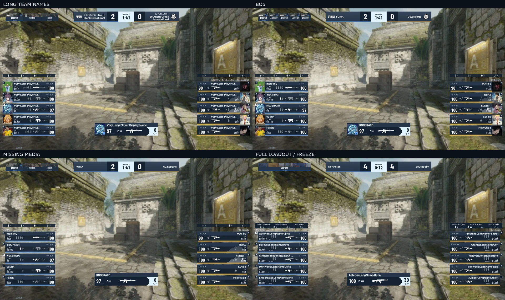

## 实际审查与修订

先在 1920×1080 渲染四套 HUD 的同一 Live / Freeze / Pause 样例，保存 main 基线，再实现与复核。保留之前已经解决的固定行位、8px C4 条与 8px 留白、存活人数居中、缺媒体收拢和准确 Logo 交接。

本次重新审查 `324060a` 后，替换了以成对短线承担品牌识别的方向。实际截图中否决了环绕整屏的蓝色边框、比分向内凹成沙漏的轮廓，以及长驻的开场大底板。最终选择：

- Waiting：大尺度开口弧面在信息区下方展开，钴蓝色面、深蓝过渡和冰白前沿具有明确面积；真实双方队标是主形态，邻近赛程为两行队名与独立比分列。计划时间避开弧面边界；补查长名与队标同时存在时，进一步压低右侧弧面，增加实际文本行与装饰线的几何相交检查。
- Gameplay：恢复完整的直边比分条，保留带蓝的冰白核心；蓝灰身份层、深色战斗层、轻微顶边亮面增加层次。弧切只放在 Focus 弹药端部和暂停赛事身份区，避免切进比分安全区。死亡或无弹药读数时收起浅色端部。
- Matchup：短暂弧面掠过与身份裁切揭示；识别停留时弧面已退场，游戏始终透出；随后由实际 DOM 边界确定 Logo 归位。完整与短版使用不同运动距离和内容，预算不变。
- 烟雾：发现默认版仍被 `design !== current` 分支排除在共享烟雾之外。删除该外观分支，四套共用原有云形遮罩、强度和渐隐；默认版适配尺寸，将姓名、HP、武器和装备置于烟雾上层。未复制第二套状态组件。
- 隔离：EWC 原先继承默认 surface；此次把其原有数值固定在自身 recipe 内，确保默认蓝灰调整不会改变 EWC。IEM/PW 继续使用各自原有 surface。用户保存的主题、布局和开关不重置。

最后以同场样本复核原图和缩图，同时检查两位数比分、长中文/英文名称、有/无队标、满装备、死亡、冻结、烟闪、暂停和换边。

### 数据与复现

`VITE_VISUAL_FIXTURES=1 pnpm --filter @mizar/web exec vite --host 127.0.0.1 --port 4173`；打开 `/preview` 可播放、重播、切换 BO1/BO5、无媒体、长名和 reduced motion。`/operator/hud` 的重放来源使用 Ancient 第 3 回合；四套预设比较使用 `real-live-rich`、`real-post-explosion-freezetime`、`real-timeout-ct`。

Waiting 的有媒体复核使用仓库已冻结的 FURIA / G2 队标和同场 Program 资料。NJU Rivals 默认等待样例的一方本来无队标，其余外部图片本次请求返回 HTTP 402，因此它只作为缺媒体与赛程兼容案例，不作为有队标主形态的证据。未替换队伍身份或补造邻近赛程。

状态复核另使用 `real-planting`、`real-planted`、`real-defusing`、`real-defused`、`real-exploded`、`real-paused`、`real-timeout-t`、`real-halftime-before/after`，C4 末段取 `ancient-round-03/replay/frames.jsonl` sequence **1158**（7.893 秒、r1nkle 实际 73 HP、站立预测 255 伤害）。预测仍来自 Program，不在浏览器重算。Radar 配对同 receive sequence 的真实样本。`player-rails-freezetime`、`stress-long-labels`、缺媒体与 BO 变体为明确的合成展示边界，不冒充真实遥测。

### 自动化与限制

新增浏览器约束覆盖共享烟雾与信息层级、浅底弹药文字对比、减少动效解除身份裁切，以及默认固定行位、C4 条留白/厚度、存活人数居中、C4 对比/预测与开关、保存的窄 Focus、BO1/3/5、双语队名、缺媒体、战术/技术暂停、换边、stale、Waiting 收拢、结果板几何、实测 Intro 终点、短版及动态 reduced motion。已有回放/Program Director 验收继续覆盖 seek、过期、取消、快速切换、阻断/恢复、轮询不重复 seek；三套赛事预设继续走保存→启用→重载与共享 renderer。

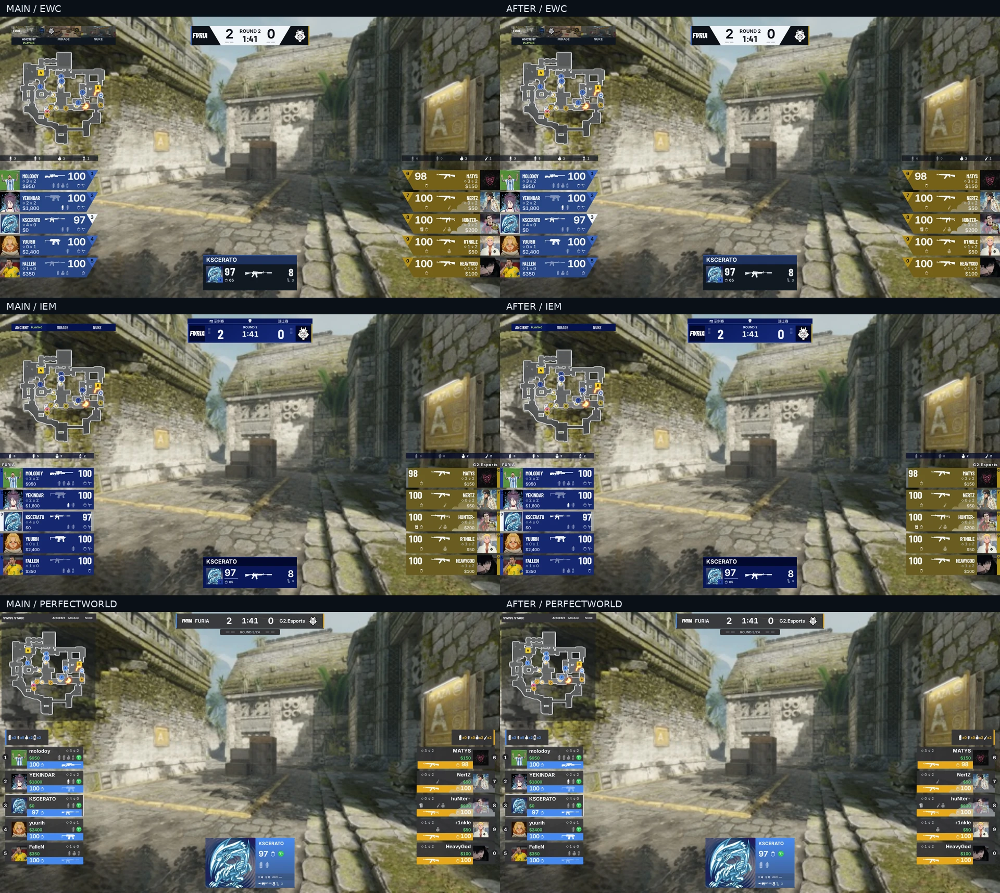

实施环境：Linux + Chromium。格式、lint、类型、架构、设计 token/contract/catalog/交互检查、构建及 fixtures 校验通过；单测 **1281 通过、2 项既有跳过**，设计 contract **100 通过**，组件交互 **13 通过**，完整浏览器验收 **58 通过**。独立 Radar consumer/release 与 production Web host smoke 通过。CI 最终状态以 PR 同 revision 的检查为准。未执行 Windows + CS2 + OBS 实机验收、真实 Game Capture 合成或 60fps 现场录像；这些仍需平台验收。

设计系统检查：本轮属于播出画面，使用现有语义 token 与受控 HUD recipe，无新增比赛颜色通道、全局产品主题或共享基础组件。BP 精确移除已迁移旧色值/字体条目；不增加目录豁免。产品控件保持原样，其键盘/焦点/禁用状态沿用既有组件测试；加载、缺失、过期与减少动效通过本轮和已有浏览器测试检查。
