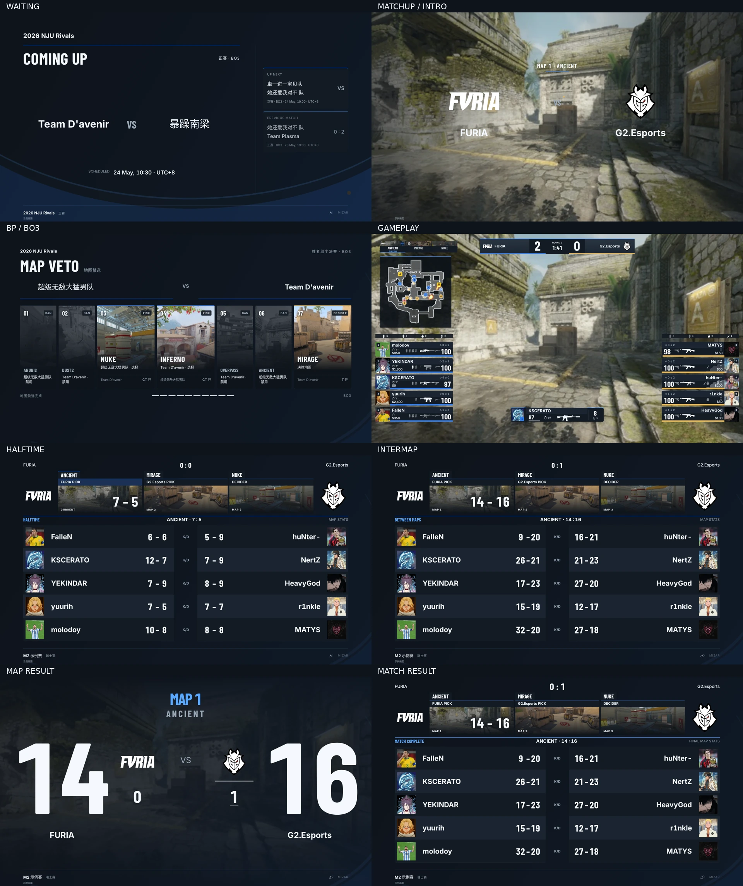
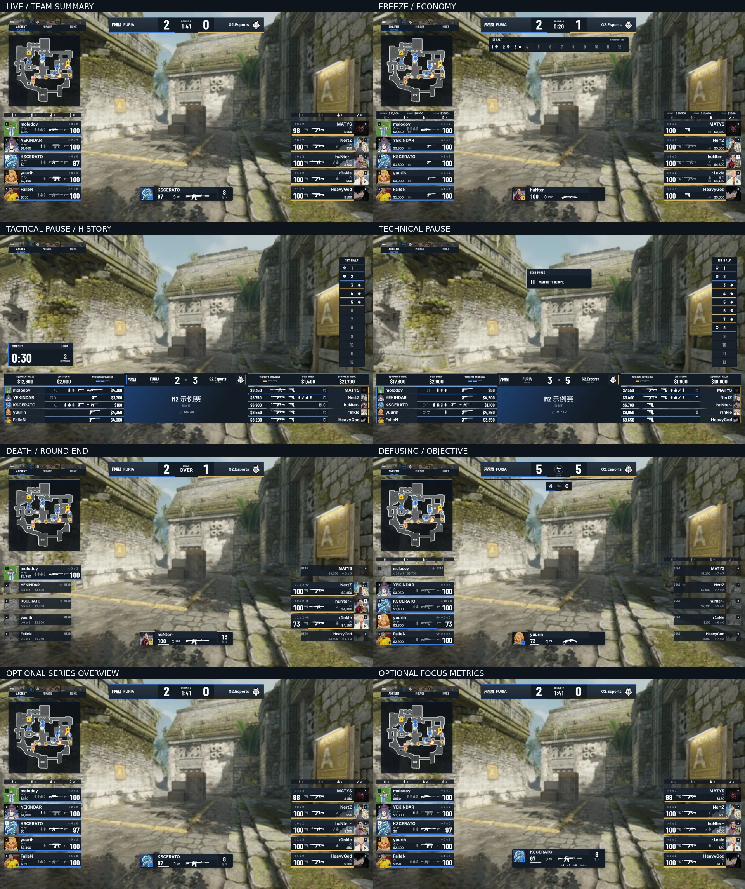

# Mizar Pulse 全场景复核

本轮继续 PR #124，在 `876271b` 的默认 Gameplay 包装上，统一全部八个默认场景及所有已实现 HUD 组件。主要布局保留；配色、材质、文字主次和状态减重遵守 [固定设计规范](../mizar-pulse.md)。未改动四套参考预设和产品控制界面的主题。

## 核对条件

截图为 Chromium 1920×1080、deviceScaleFactor=1，来自仓库实际 renderer。Gameplay 使用同一 Ancient 缩略图背景、Steam 头像与 Program fixture；Radar 使用独立 dense-utility 记录，不能视为同步比赛录像。live / freeze / pause / technical / planting / planted / defusing / defused / death 使用真实回放提取投影；满装备、长昵称、Focus 边界及状态效果为合成样例。Waiting、统计页和结果页使用已有场景 preview 数据；BP 使用内置公开赛事 demo，非本次真实现场禁选。

大部分截图启用 reduced motion，Intro 截在原动画 2200ms 时刻；单独浏览器测试检查 2s/6s 落位、缺失媒体与 reduced motion。没有执行 Windows / CS2 / OBS 实机验收。所有 WebP 单图保留 1920×1080 原尺寸，联系表仅用于快速扫读。

## 八个默认场景

| 场景 | 原尺寸 | 本轮修改 |
| --- | --- | --- |
| Waiting | [查看](mizar-native/scenes/waiting.webp) | 弧面 0.14、蓝白正文、深壳赛程与层级调整 |
| Matchup / Intro | [查看](mizar-native/scenes/matchup.webp) | 弧面 0.10、冷白字、蓝色地图标题线；原导演时序保留 |
| BP | [BO1](mizar-native/scenes/bp-bo1.webp) · [BO3](mizar-native/scenes/bp-bo3.webp) · [BO5](mizar-native/scenes/bp-bo5.webp) · [揭示中](mizar-native/scenes/bp-revealing.webp) | 深壳、蓝 PICK / 金 DECIDER、仅 BAN 灰化；失效队标隐藏破图文字 |
| Gameplay | [查看](mizar-native/scenes/current-live.webp) | 所有组件统一深壳与亮读数，去除侧栏重复队名 |
| 半场 | [查看](mizar-native/scenes/halftime.webp) | 深色隔行、标题与比分层级，保留十人镜像表 |
| 图间 | [查看](mizar-native/scenes/intermap.webp) | 同一统计壳体，当前地图蓝色局部强调 |
| 单图结果 | [查看](mizar-native/scenes/map-result.webp) | 去队标方框、冷白大比分、低对比背景与弧面 |
| 整场结果 | [查看](mizar-native/scenes/match-result.webp) | 系列比分 48px，完整比赛与达到 requiredWins 才强调胜方 |

Waiting / Intro 之外的信息页和 BP 弧面整体透明度 0.06。半场、图间、整场结果的顶部系列区域结束于 y=73，地图标签起于 y=80；十人表仍为 x=120 / y=360 / 1680×600。单图结果的巨型比分与锚点保留。

## HUD 状态与所有已实现组件

| 状态/组件 | 原尺寸 |
| --- | --- |
| 比分、侧栏、Focus、地图条、雷达、Team Summary | [Live](mizar-native/scenes/current-live.webp) |
| Freeze 与经济摘要 | [Freeze](mizar-native/scenes/current-freeze.webp) |
| 战术暂停、装备/经济、剩余暂停次数、回合历史 | [Pause](mizar-native/scenes/current-pause.webp) |
| 技术暂停与缺失 owner | [Technical](mizar-native/scenes/current-technical.webp) |
| 死亡、回合结算 | [Death](mizar-native/scenes/current-death.webp) |
| 下包 | [Planting](mizar-native/scenes/current-planting.webp) |
| 已下包 | [Planted](mizar-native/scenes/current-planted.webp) |
| 拆弹 | [Defusing](mizar-native/scenes/current-defusing.webp) |
| 拆弹完成 | [Defused](mizar-native/scenes/current-defused.webp) |
| 满装备与经济读数 | [Full equipment](mizar-native/scenes/current-full-equipment.webp) |
| 闪光、烟雾与燃烧效果（合成） | [Status effects](mizar-native/scenes/current-status-fx.webp) |
| 地图详情（默认关闭，本图手动启用） | [Overview](mizar-native/scenes/current-overview.webp) |
| Focus metrics（默认关闭，本图手动启用） | [Metrics](mizar-native/scenes/current-metrics.webp) |

最后两项用户修正已包含：侧栏重复队名隐藏，Team Summary 下移 16px、与第一张选手卡留 8px，首张卡 y=558、后续每行 +84px 不变；剩余暂停格继续填充 CT/T 事实色，已用格保持透明内底和 `#9AA8B7` 边框。底部暂停栏仍保留双方完整队名。

原像素局部：[已用暂停格](mizar-native/scenes/pause-slots.webp) · [左侧栏](mizar-native/scenes/left-rail.webp) · [右侧栏](mizar-native/scenes/right-rail.webp) · [Focus 弹药留白](mizar-native/scenes/focus-ammo.webp)。

`objective` / `round-result` 独立槽原本没有 renderer，仍由比分组件承载其已实现功能，没有新增数据 owner。已保存自定义外框不自动迁移。

## 边界画面

| 边界 | 原尺寸 |
| --- | --- |
| Waiting 长队名 / 无媒体 / 无赛程 | [长名](mizar-native/scenes/waiting-long-names.webp) · [无媒体](mizar-native/scenes/waiting-no-media.webp) · [无赛程](mizar-native/scenes/waiting-no-schedule.webp) |
| 半场长名 / 无媒体 | [长名](mizar-native/scenes/halftime-long-names.webp) · [无媒体](mizar-native/scenes/halftime-no-media.webp) |
| 图间 / 整场结果 BO5 | [图间](mizar-native/scenes/intermap-bo5.webp) · [整场结果](mizar-native/scenes/match-result-bo5.webp) |
| 单图结果长队名 | [查看](mizar-native/scenes/map-result-long-names.webp) |
| HUD 长英文 / 中英文混合昵称 | [英文](mizar-native/scenes/current-long-names.webp) · [中英文](mizar-native/scenes/current-long-zh.webp) |
| Focus 低生命 / 霰弹 / 手雷 / 死亡 | [低生命](mizar-native/scenes/current-low-health.webp) · [霰弹](mizar-native/scenes/current-shotgun-ammo.webp) · [手雷](mizar-native/scenes/current-grenade.webp) · [死亡](mizar-native/scenes/current-dead-focus.webp) |

## 验证

本轮检查覆盖默认选手固定行位、Team Summary 间距、已用暂停格描边、暂停 owner/设置、失效媒体、Intro 落位、系列事实与 BP 禁选状态。最终 web 构建、完整类型检查、lint、格式检查与架构检查（0 violations）通过；设计系统 100 项契约与 13 项浏览器组件样例通过。场景/HUD/BP 28 项浏览器检查通过，补充失效 BP 队标检查 3/3 通过。完整单元首次与多路构建/截图并发时有 4 项超时或时序失败；在较低并发 `--maxWorkers=2` 下完整复跑为 1288 通过、2 个既有跳过，未修改相关服务测试或实现。
