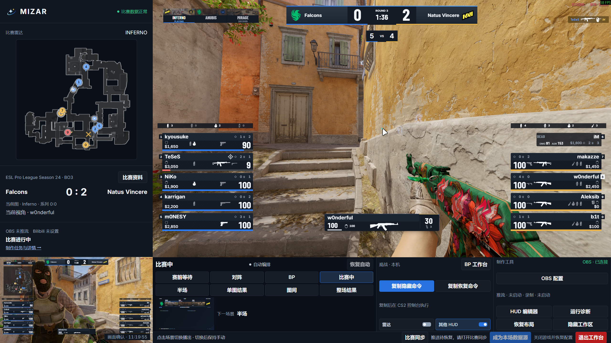
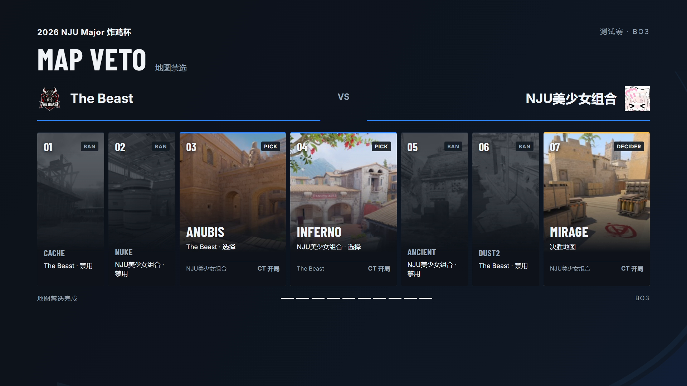
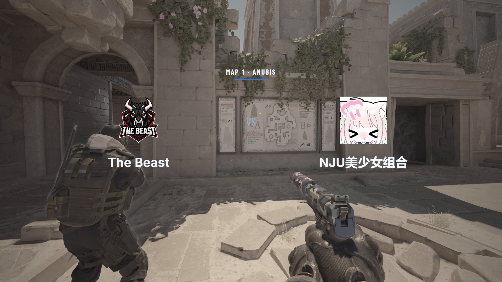
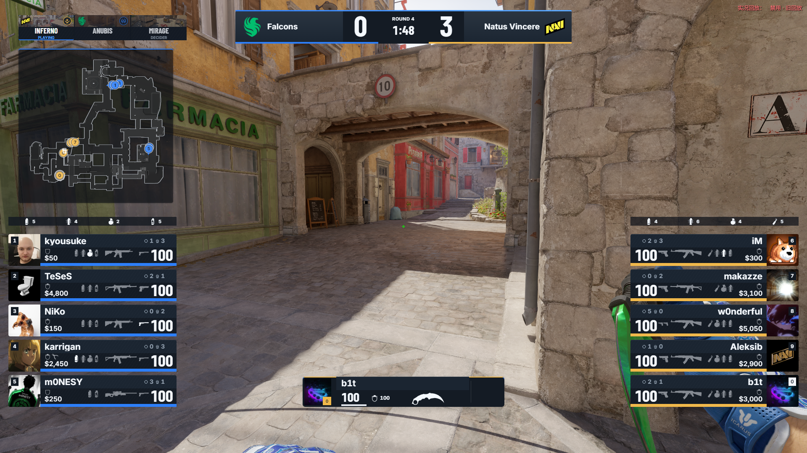
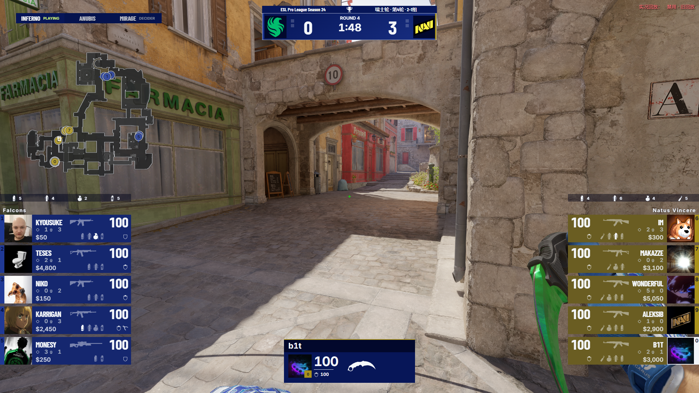
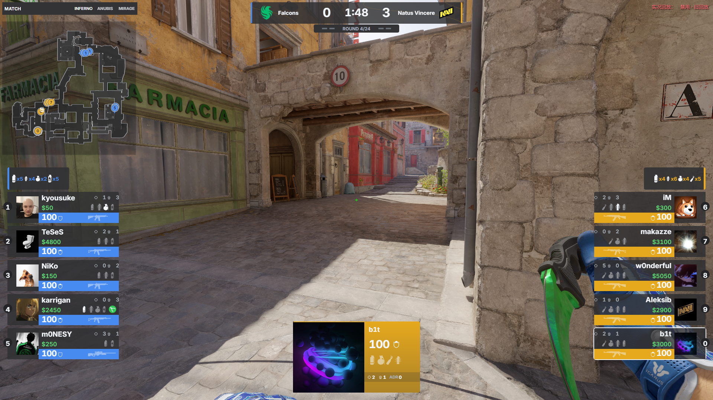

# 产品画面

## 制播工作台

真实游戏画面、大雷达、比赛资料与制作控制集中在同一屏幕。

## 地图禁选与对阵开场

地图禁选依次展开，随后通过对阵动画进入局内画面，形成连贯的节目开场。

[观看地图禁选动图](program-veto.gif)

[观看 BP → 对阵动画 → 局内 HUD 的完整衔接](program-opening.gif)

## HUD 风格

Mizar Pulse 提供从赛前到赛后的统一节目包装；其余预设提供各具特色的局内 HUD。通过编辑器调整组件、布局与外观，让画面契合自己的赛事。

### Mizar Pulse

### EWC

### IEM

### Perfect World

### ESL

操作步骤见[HUD 预设与文件分享](../guide/quick-start.md#hud-预设与文件分享)，图片来源与摘要见[图集元数据](provenance.json)。
