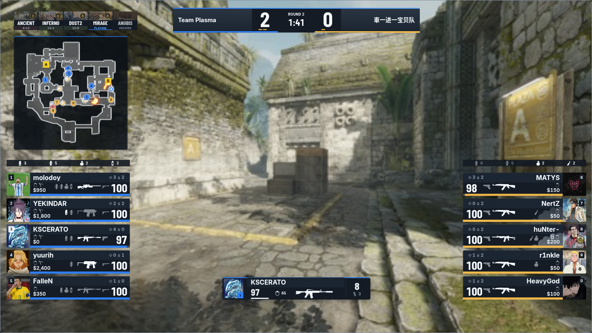
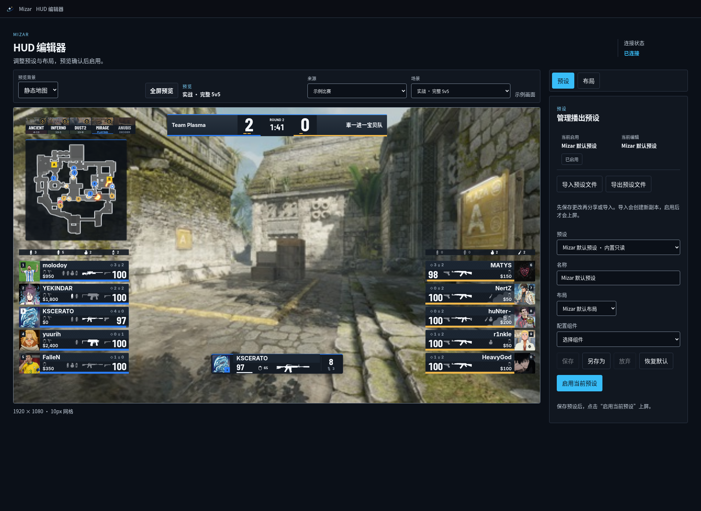
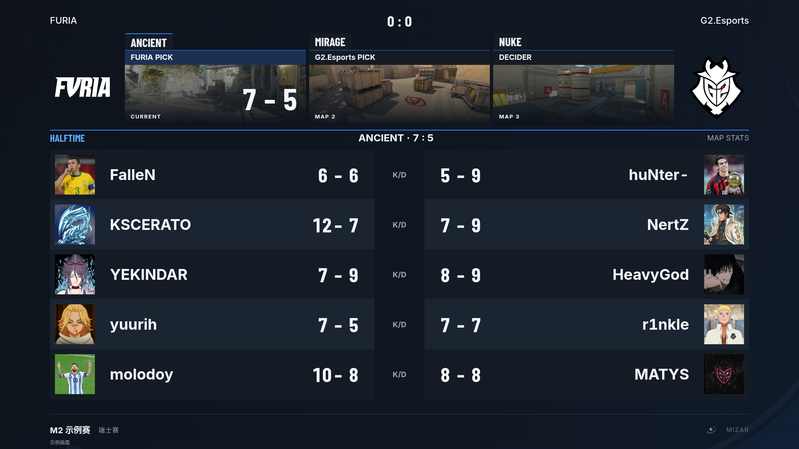
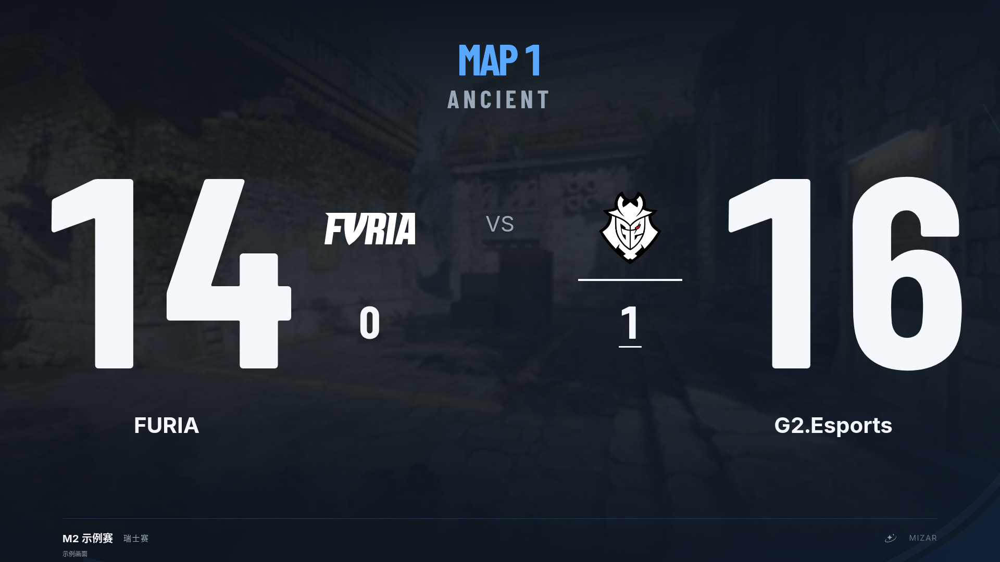

# 当前画面预览

Windows 实机画面见 [RC22 真实 demo 图集](windows-rc22/README.md)：五套 HUD 使用同一职业比赛的真实 Steam 头像与队标，另有完整工作区。该图集标明实际构建、截图方法与证明范围。

本页下方保留生产渲染器在浏览器中的示例效果；这些示例不是 Windows 实机或正式赛事转播截图。

## 默认 HUD 与编辑器





HUD 使用编辑器的“示例比赛 → 实战 · 完整 5v5”与默认预设。局内选手/雷达来自真实采集派生样例，赛事图条与队名含独立 Rivals 展示资料；两者不代表同一场比赛。背景是静态 Ancient 地图缩略图，不是同步游戏视频。

## 半场与单图结果





这些页面来自节目预览的默认样例，调用实际节目渲染器；赛事名称、地图计划与统计用于展示版式，不作为真实赛果发布。

## 来源与重现

- 截取日期：2026-10-05。
- 产品源码：`5fd37023d5ff5c3e455e8b0a850ee190a946b9ba`；本次仅修改文档，未改渲染器。
- 环境：Linux、Chromium、Vite 开发预览，`VITE_VISUAL_FIXTURES=1`；未连接真实 CS2、OBS 或直播平台。
- 半场：`/program/halftime?preview=1&variant=default&background=map`。
- 单图结果：`/program/map-result?preview=1&variant=default&background=map`。
- HUD 编辑器：`/operator/hud`；HUD 单图直接截取 `.hud-console__canvas-frame`，没有重绘或修改画面内容。
- 节目页视口 1920×1080；编辑器视口 1920×1400。等待字体与内容加载后截取；样例源码见 [program/fixtures](../../apps/web/src/program/fixtures/)。

准备依赖与构建见[开发验证](../development-validation.md#本地运行)，再运行：

```sh
VITE_VISUAL_FIXTURES=1 pnpm --filter @mizar/web exec vite --host 127.0.0.1 --port 4173
```

浏览器检查覆盖页面加载、预览选择、HUD 编辑器、首页导航和错误记录；不证明自动切场或 Windows 制播流程通过。

## RC27 Windows 采集矩阵

RC22 的 15 张实机图保留为基础布局与节目包装的审美基线，不证明五套 HUD 的全部组件和状态已覆盖。#177 代码收尾后，使用同一个未经修改的 RC27 按下列矩阵采集；自动化回归不代替人工审美确认。现场结果记录在 [#35](https://github.com/Starfie1d1272/Mizar/issues/35)。

### 主矩阵：5 组 × 5 套，共 25 张

Mizar Pulse、EWC、IEM、Perfect World、ESL 使用同一 Demo 的相同回合／事件点，输出统一为 1920×1080 OBS 节目画面。

| 组 | 取景时机 | 覆盖重点 | 张数 |
| --- | --- | --- | --- |
| A | 第 4 或第 7 回合冻结期开始后 1–3 秒，倒计时仍大于 3 秒 | 经济、完整装备、真实地图序列、短时回合历史、PW 冻结期地图详情 | 5 |
| B | 正常回合开始 6 秒后，仍为 5V5 | 实战排布、观察选手、雷达、道具汇总、比分 | 5 |
| C | 首杀后 1–3 秒形成 5V4，优先伴随低血量或多杀 | 死亡卡、短时减员提示、低 HP、击杀徽章及显隐 | 5 |
| D | C4 剩余 10 秒以内、正在有效拆弹的片段 | C4 进度、拆弹圆环、钳子、伤害预测、危险状态 | 5 |
| E | 真实战术暂停激活，进入动画完成 | 暂停整页、双方经济装备、赛事身份、剩余暂停 | 5 |

A 组的回合历史约展示 5 秒，需要可靠历史与实际触发条件；C 组在 4.5 秒减员提示窗口内取景，Perfect World 的既定策略是不显示该提示，应核对其正常缺席。低甲 1–25 的数值尽量在 C 组或少量边界补图中覆盖。D 组若不能同时取得有效拆弹与末 10 秒状态，拆成两个真实取景点，允许增加图片，不拼接或伪造同一帧。

从事件前开始正常播放，让实际减员、回合与道具生命周期触发后取景；不能用 seek 后首次接入的一帧冒充已发生的提示动画。暂停 Demo 仅可辅助静态比较，不把回放暂停写成战术暂停，也不以静态停帧证明动态时序。

### 定向补拍：约 10 张

| 内容 | 预设／位置 | 张数 |
| --- | --- | --- |
| 反弹后、落地前的完整虚线飞行路径 | 默认、PW、ESL 三种雷达外观；共享轨迹语义 | 3 |
| 投掷物落地后的烟雾与燃烧区域 | 默认、PW 各一 | 2 |
| C4 安装与普通回合结束胜方附加面板 | PW | 2 |
| Nuke 上下楼层 | PW、ESL 或默认，两层各一 | 2 |
| 技术暂停 | 默认或 ESL | 1 |

Nuke 需要另一地图 Demo 时单独记录来源，使用相同事件点比较对应预设。缺头像、无 BP、超长名称及 BO5 地图条按实际缺口少量补充，不把每种异常乘以五。无法取得的真实状态标记未覆盖；合成边界样例另行标识，不混入实机主矩阵。

### 受影响节目、工作台与动态片段

- 工作台 2–3 张：上半场预告半场、下半场预告单图结果、手动保持仍有正确预告。工作台按实际桌面尺寸采集并记录分辨率／DPI，不把它裁成 OBS 节目画面。
- Matchup 2–3 张：进入、队标展开、接近 HUD 落位的末段；至少涉及默认与布局差异较大的 ESL 或 PW。
- 缺失数据边界 1–2 张：无 BP 时地图条隐藏与默认雷达上移、缺头像／队标时布局保持。
- 三段短视频：投掷物飞行至落地、C4 安装至拆弹、Matchup 至 Gameplay。保留完整过渡，静态图不能证明圆环、掉血残影、烟雾生长消散与轨迹运动顺畅。

八个节目场景不等于五套独立节目包。其余全屏节目主要使用统一 Mizar Pulse 包装，旧 RC22 非 Gameplay 图可继续作审美基线，不机械拍摄 8×5 张。`objective`、`round-result` 是未实现的独立 Widget 占位，实际信息由比分栏等组件承载，不为占位项截图。

### 每份图像／视频的来源记录

至少记录：文件名与 SHA-256、预设 ID、Demo 文件与校验和、地图／回合／tick 或真实事件时间、RC 版本和完整源码 SHA、产品包摘要、采集日期、Windows／WebView2／CS2／OBS 版本、输出分辨率／帧率及桌面 DPI、真实回放或合成边界、缺失条件及是否完成动画。未知字段保持待补，不填写推测值。

先交付 25 张横向对照与约 10 张定向补拍，再补受影响节目与边界。设置页的保存／重载、已配置密钥掩码和版本信息另作本轮功能验收，不占用 HUD 主矩阵。准确采集由 Agent 协助，最终审美结论由人工确认；清单不是已经采集或验收通过的声明。

OBS 输出与工作台应核对私有控制未进入正式节目；实际推流／B 站状态可随现场演练补充。避免暴露推流密钥、令牌、私人路径或无关窗口。真实截图补齐后可替换 README 示例，保留每份来源记录。

## 文件记录

| 文件 | 像素 | SHA-256 |
| --- | --- | --- |
| `halftime.png` | 1920×1080 | `aa1ae6055160ea83467959860723fd2c6935586ecd080285d025ae830af20562` |
| `hud-editor.png` | 1920×1401 | `2e51279cb5ce0db9a48a2ed82ebb603a00d91a29c5238777d00ca3193321f1c4` |
| `hud.png` | 1444×812 | `375e5143503cb550e6cdf67a63b496e169caad02ac4c312f5df51c47f1bb2314` |
| `map-result.png` | 1920×1080 | `9f9c1a85d05df5a0dfa3418202bb3a38d657fc1a2815bf65c587bc86b309f19a` |
