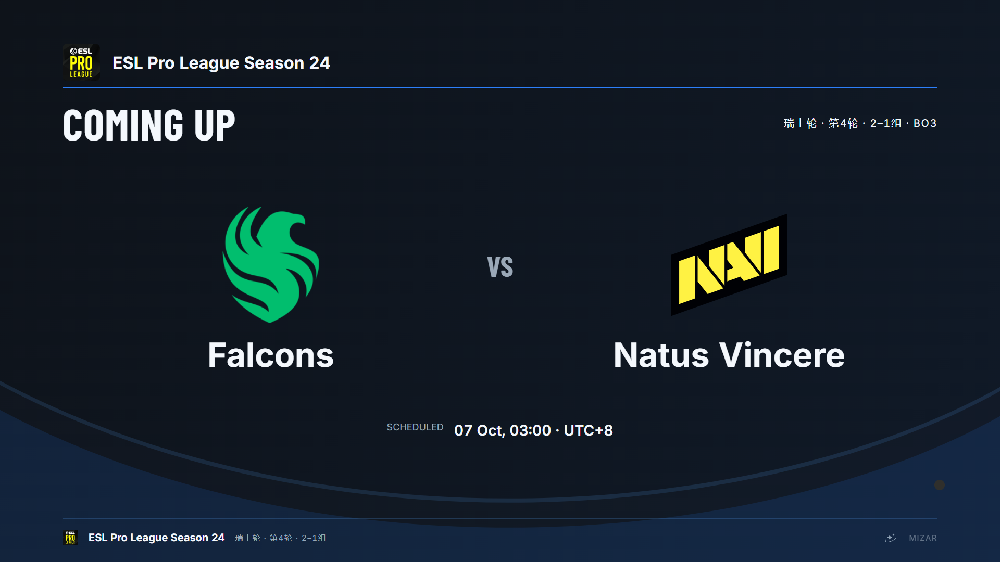
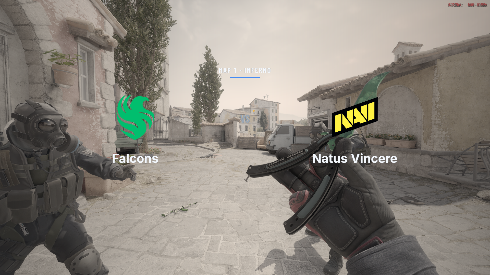
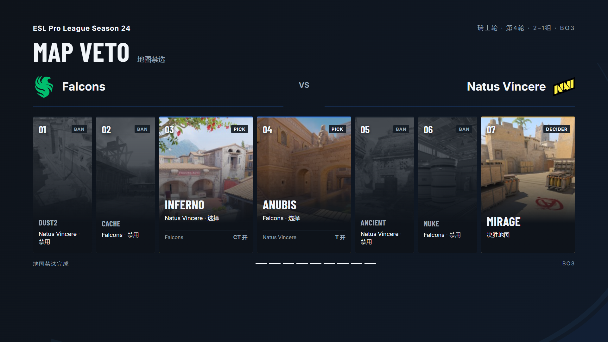
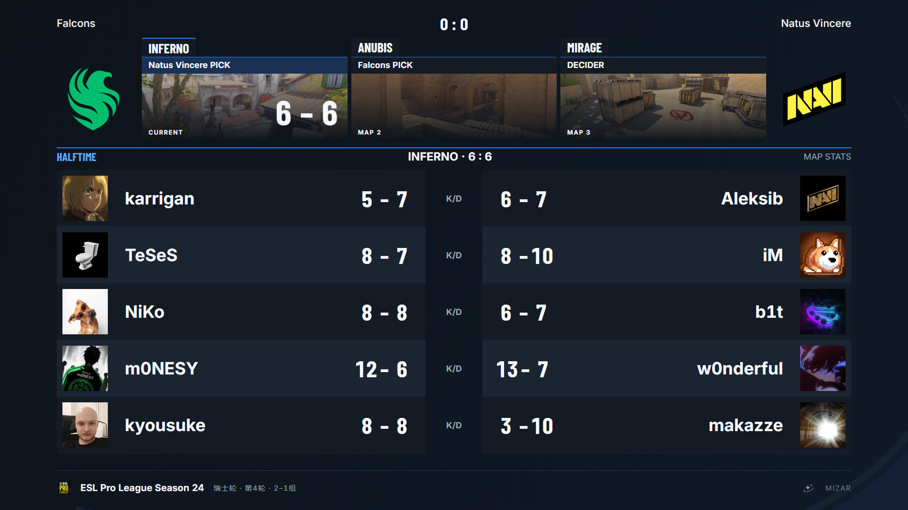
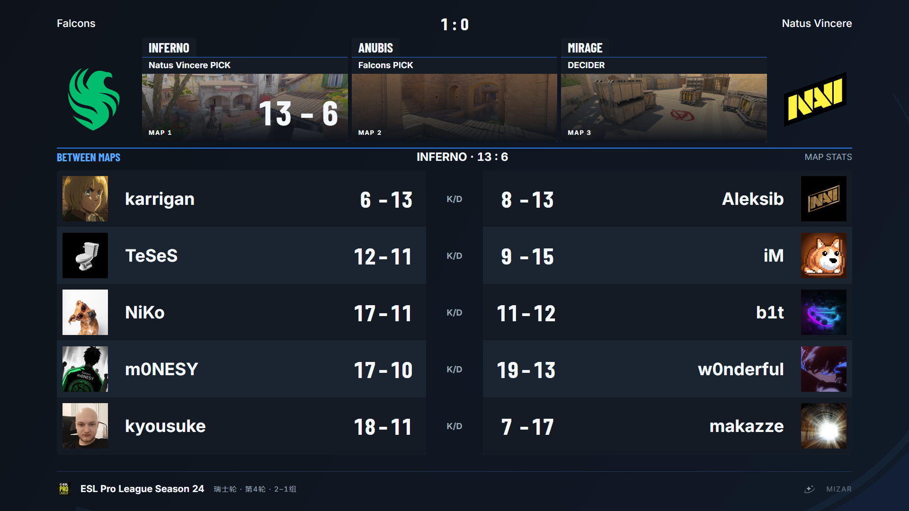
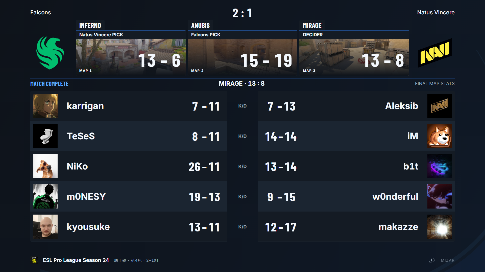

# Windows 真实 demo 图集

本目录使用未经修改的最终 [RC22](https://github.com/Starfie1d1272/Mizar/releases/tag/v1.0.0-rc.22)、真实 CS2 demo 与实际 OBS 输出。源码 `6e84cd2eaa027ae322ad486b6b2ab31e18e2d486`；包身份、验收结果与未完成项由 [#35](https://github.com/Starfie1d1272/Mizar/issues/35) 维护。

本轮保留15张最终截图：五套HUD、完整工作区、真实战术暂停、GG，以及等待、对阵、BP、半场、单图结果、图间、整场结果。旧配置的九张图已用真实赛事资料重拍替换，不在目录中另存重复版本。

## 五套 HUD

以下画面来自同一个 Inferno 冻结回合，比分 Falcons 0:3 Natus Vincere；截图期间暂停 demo 播放以比较版式，不表示比赛战术暂停。全部使用 demo 原始选手身份与实际 Steam 头像，未用选手照片替代 Steam 头像。控制台及底部 demo 进度条已隐藏，像素没有重绘或拼接。

## 赛前页面

使用实际赛事名称、EPL Logo与瑞士轮资料。禁选取自HLTV比赛页面；Inferno由Falcons选CT、Anubis由NAVI选T，Mirage不预填拼刀结果。等待、对阵与BP由正常制作控制人工选场景；对阵背景是同一真实demo的游戏画面。

## 完整工作区

工作区为实际2560×1440物理屏幕、150%缩放，通过临时OBS显示器捕获保存；包含游戏、本机HUD、大雷达、制作控制与OBS画面确认。任务栏隐藏，左栏贴底，三个区域之间没有白色缝隙。未推流、未录制，不证明公网观众端音画质量。

## 战术暂停与赛后

暂停来自demo中CT暂停字段明确激活的tick44700附近，显示Falcons暂停、比分1:4和剩余约29秒；实际暂停身份与倒计时来自游戏，截图时停止回放以固定构图。

末局从tick191000附近跳转后以1x自然播放，自动GG后切到单图结果，比分13:6、系列1:0。该片段用来拍摄场景，不是全图统计验收；没有把中途接入的伤害统计称作完整地图ADR。

## 半场、图间与整场结果

半场取自tick113000的真实6:6；图间取自Inferno实际结算后的系列1:0。整场页依次加载三张真实demo，各图从末局附近以1x自然完成，得到13:6、15:19、13:8与Falcons系列2:1；没有手工录入网站最终比分。Mirage使用p1确认开局、p2续录完成结算。整场页的十人统计明确为最后一图K/D，不是三图累计或完整ADR。

这些页面通过正常制作控制人工选场景。选景有跳转，不能替代无跳转完整多图、自然自动过场和长时统计验收。

## 来源与范围

2026-10-07 从[赛事页面](https://www.hltv.org/events/8244/esl-pro-league-season-24)与比赛页面核对并保存真实赛事名称、EPL Logo、瑞士轮第4轮（2–1组）、晋级说明与完整7步禁选，按用户提供的EPL规则补充两次对手选边，共9步。三张地图的实际开局均已用游戏内GSI核对为Falcons CT、NAVI T；Mirage的赛前配置仍留空，实际开局不能冒充拼刀前的选边。具体来源、RC22编辑器限制和核验范围见[赛事资料](epl-source.json)。

- 截取日期：2026-10-07。五套HUD由实际OBS节目源输出，1920×1080；逐套等待界面及OBS加载后截图。
- demo由用户提供，比赛与队标核对来源：[Falcons vs. Natus Vincere / ESL Pro League Season 24](https://www.hltv.org/matches/2398745/falcons-vs-natus-vincere-esl-pro-league-season-24)。队标是赛事页面实际引用的HLTV素材，商标属于各队。
- 本机比赛资料按实际赛事BP和demo名单配置，地图顺序Inferno→Anubis→Mirage；比赛结果来自实际GSI。截图为用户提供demo的本机回放展示，不代表官方直播。
- Steam头像使用用户授权的现有Key，由Mizar本机缓存加载；密钥与原始身份映射不入库。公开截图保留职业选手公开昵称与其实际头像。
- `provenance.json`记录具体文件、来源和校验和。冻结、真实战术暂停、GG、单图结果与工作区分别记录，不能把选景截图代替完整多图及长时验收。
